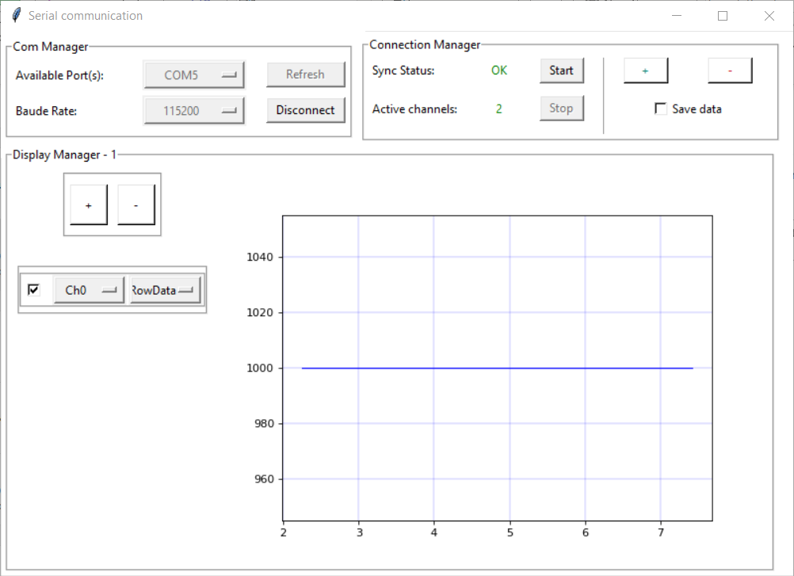
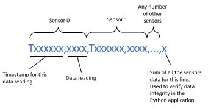

# MicrocontrollerDataLogger
This project is a python-based application that will plot and record live streaming data from a microcontroller. There are two main parts to the project. First the data recording application that collects the streaming data from the microcontroller. Secondly the microcontroller code that reads the sensors and sends the data to the python application.

## Data Recording Application
  
The python UI code was adapted from [Weew Stack's project](https://github.com/weewStack/Python-projects/tree/master/004-PySerial%20-%20MCU%20-%20Multi-Datareadings) and changed in a few ways (listed below) to better suit my application. WeeW Stack has a very useful and extensive [YouTube video series](https://www.youtube.com/playlist?list=PLtVUYRe-Z-meHdTlzqCHGPjZvnL2VZVn8) explaining his code, I highly encourage you to watch it.

#### Changes made:
1. Changed the format of the data stream from the microcontroller to CSV, according to the below convention.
1. Record timestamps from the microcontroller to display high speed data more accurately.
1. Added the ability to adjust the length of time displayed on the charts.
1. Converted the python application to an [executable](PythonUI/dist/) for easier sharing.

#### Application UI:

## Microcontroller Code

There's an example of the microcontroller software in the "PIO" directory (this directory is a Platformio project). The main code is [here](PIO/DataLogger/src/main.cpp). This code records readings from 2 pressure sensors via an ADS1115 ADC and converts the ADC values to actual pressure numbers. You can easily adapt this code to suit your application. Just follow the guidelines below.

1. `int numSensors = 2;` change to the number of sensors you want to collect data from.
1. When the data recorder application tries to connect to the microcontroller it will send "#?#" over Serial. The microcontroller should reply with "#!#n#", where n = numSensors.
1. To start the data stream the application with send "A", and to stop it "S".
1. The data should be serial printed in CSV format according to the following convention.

    * Timestamps need to start with a "T" then the time in milliseconds (use Arduino's millis() function)
    * The data readings can be any number/units you want.
    * The very last field of each line needs to be the sum of all the data readings on that line. This is used by the data recorder to verify data integrity. If the sum isn't correct, that line is ignored.
1. The code includes a special calibration mode to assist with setting the sensor calibrations. This isn't entirely necessary but can be useful.

 Contributing
  
Contributions to this project are welcome. If you find any issues or have suggestions for improvements, please open an issue or submit a pull request on the GitHub repository.

 License 

This project is licensed under the GNU General Public License. Feel free to use, modify, and distribute the code for personal or commercial purposes.

Acknowledgements

I would like to express my sincere gratitude to WeeW Stack ( https://github.com/weewStack ), for creating the code which served as the foundation for this project.  
  
Please check out his code here:  https://github.com/weewStack/Python-projects/tree/master/004-PySerial%20-%20MCU%20-%20Multi-Datareadings  
And his Youtube video series on this project:  https://www.youtube.com/playlist?list=PLtVUYRe-Z-meHdTlzqCHGPjZvnL2VZVn8

Special thanks to the developers of the libraries and frameworks used in this project for their contributions to the open-source community.

