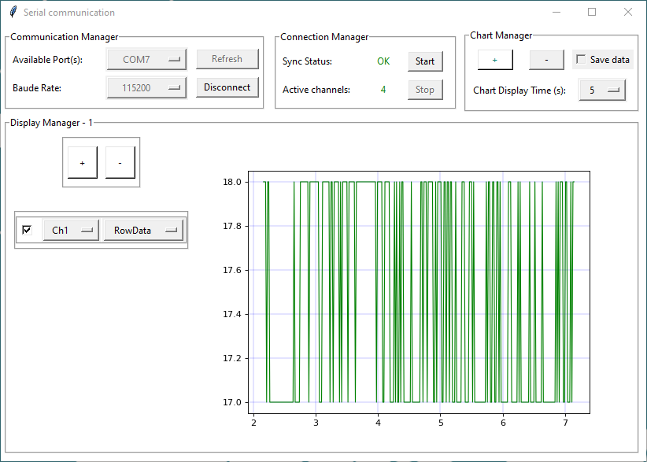

# MicrocontrollerDataLogger
This project is a python based application that will plot and record live streaming data from a microcontroller.  
  
The python UI code was adapted from [Weew Stack's project](https://github.com/weewStack/Python-projects/tree/master/004-PySerial%20-%20MCU%20-%20Multi-Datareadings), and changed to allow the data to be sent from the microcontoller in CSV format. WeeW Stack has a very useful and extensive [Youtube video series](https://www.youtube.com/playlist?list=PLtVUYRe-Z-meHdTlzqCHGPjZvnL2VZVn8) explaining his code, I highly encourage you to watch it.
  
I wrote my own version of the microcontroller software, which is in the "PIO" directory (this directory is a Platformio project). The main code is [here](PIO/DataLogger/src/main.cpp), you can easly adapt the main loop() to collect any sensor readings you need, and print them to the serial moninator in CSV format.
  

Python UI:

 Contributing
  
Contributions to this project are welcome. If you find any issues or have suggestions for improvements, please open an issue or submit a pull request on the GitHub repository.

 License 

This project is licensed under the GNU General Public License. Feel free to use, modify, and distribute the code for personal or commercial purposes.

Acknowledgements

I would like to express my sincere gratitude to WeeW Stack ( https://github.com/weewStack ), for creating the code which served as the foundation for this project.  
  
Please check out his code here:  https://github.com/weewStack/Python-projects/tree/master/004-PySerial%20-%20MCU%20-%20Multi-Datareadings  
And his Youtube video series on this project:  https://www.youtube.com/playlist?list=PLtVUYRe-Z-meHdTlzqCHGPjZvnL2VZVn8

Special thanks to the developers of the libraries and frameworks used in this project for their contributions to the open-source community.

